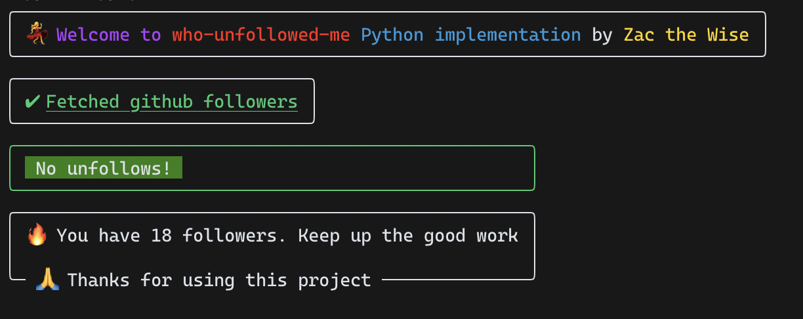

# Who Unfollowed Me

## Python Implementation


**HacktoberFest info coming soon**

### About

Python CLI tool that shows you who has unfollowed you on GitHub.  
Heavily inspired by [msaaddev/who-unfollowed-me](https://github.com/msaaddev/who-unfollowed-me)  

### Installation


```py
pip install unfollow
```

### Usage

The first time you run the tool, you will be asked to enter your GitHub username. Subsequent runs will show any unfollowers, with names and links.  

I used this project to learn a lot about [rich](https://github.com/Textualize/rich), thus I created numerous themes which you can use.

`unfollow` - colored text and some panels  
`unfollow panels` - colored text inside panels  
`unfollow bubbles` - all text inside beautiful bubbles - requires a nerd font  
`unfollow simple` - no colors or emojis, just plain text and a table - coming soon  

### Inspiration

As mentioned, [msaaddev/who-unfollowed-me](https://github.com/msaaddev/who-unfollowed-me) was the reason I created this project and has been a great reference. While I love the project, three things stood out to me that I wanted to improve in my own implementation:
1. The data files for the tool are not hidden and are stored in your current directory rather than the home directory
2. Output looks good but a huge amount is self promotion rather than actual relevant info. (Please don't get me wrong, everyone can self promote as much as they like, I'm just talking about what I wanted to improve)
3. If the tool is run without internet connection, the file that stores the username is erased

### Gallery

#### Bubbles (w/nerd font)
  

#### Panels


---
### 🎉 Commit labels
If you're interested in the commit labels used in this repo, check out my [git-commit-emoji](https://github.com/TechWiz-3/git-commit-emojis) project
